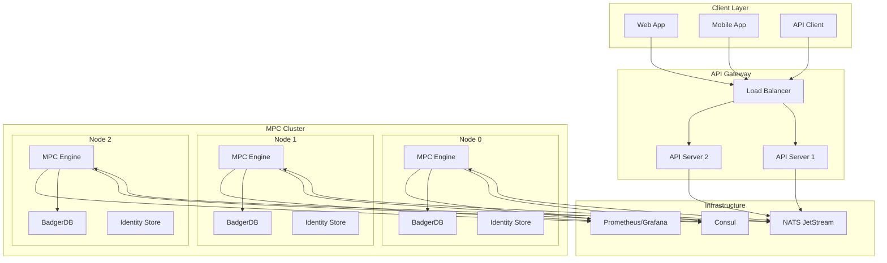
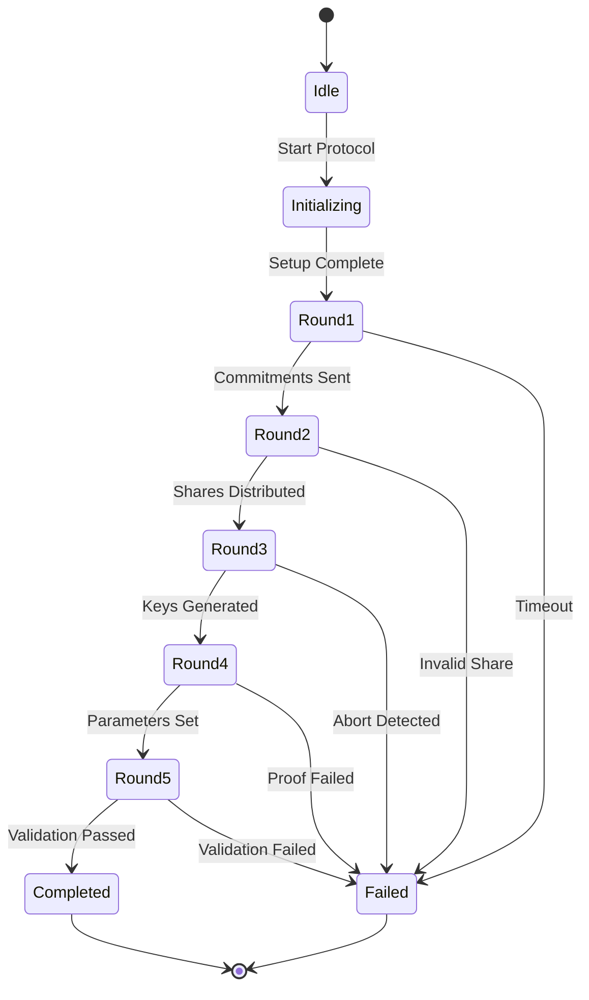

# Lux Multi-Party Computation (MPC) Protocol

## Overview

Lux MPC is a high-performance, production-grade Multi-Party Computation engine that enables secure generation and management of cryptographic wallets across distributed nodes. The protocol ensures that no single party ever has access to the complete private key, providing unprecedented security for digital asset custody.

## Key Features

- **Threshold Cryptography**: Implements t-of-n threshold schemes for distributed key management
- **Multi-Algorithm Support**: ECDSA (secp256k1) for Bitcoin/Ethereum and EdDSA (Ed25519) for Solana/Polkadot
- **Production Ready**: Battle-tested implementation with comprehensive test coverage
- **High Performance**: Optimized for low-latency signing operations
- **Fault Tolerant**: Continues operating even with node failures (up to n-t nodes can fail)
- **Secure by Design**: Private keys never exist in complete form
- **Byzantine Resilient**: Tolerates malicious nodes up to threshold
- **Key Rotation**: Supports dynamic resharing for security updates

## Protocol Overview

### MPC Protocol Phases

The Lux MPC protocol operates in distinct phases to ensure security and reliability:

#### 1. Setup Phase
- **Node Initialization**: Each node generates Ed25519 identity keypairs for authentication
- **Service Discovery**: Nodes register with Consul for dynamic discovery
- **Secure Channel Establishment**: TLS connections with mutual authentication
- **Threshold Configuration**: Setting t-of-n parameters where t ≥ ⌊n/2⌋ + 1

#### 2. Key Generation Phase (DKG - Distributed Key Generation)
- **Round 1**: Commitment to secret shares using Pedersen commitments
- **Round 2**: VSS (Verifiable Secret Sharing) share distribution
- **Round 3**: Paillier key generation for homomorphic operations
- **Round 4**: Ring-Pedersen parameters generation
- **Round 5**: Final share validation and public key computation

#### 3. Signing Phase
- **Preprocessing**: Generate ephemeral nonces (k, γ values)
- **Partial Signing**: Each party computes partial signatures
- **Signature Aggregation**: Combine partial signatures into final signature
- **Verification**: Validate signature against public key

#### 4. Resharing Phase (Key Rotation)
- **Share Refresh**: Generate new shares without changing public key
- **Proactive Security**: Periodic rotation to limit exposure window
- **Dynamic Membership**: Add/remove parties from the protocol

## Security Model

### Cryptographic Foundations

The protocol is built on several cryptographic primitives:

1. **Shamir Secret Sharing**: Polynomial interpolation for threshold schemes
2. **Pedersen Commitments**: Binding and hiding commitments for shares
3. **Paillier Encryption**: Additively homomorphic encryption for secure computation
4. **Zero-Knowledge Proofs**: Proving knowledge without revealing secrets
5. **Verifiable Secret Sharing (VSS)**: Ensuring honest share distribution

### Threat Analysis

#### Protected Against
- **Key Extraction**: Private key never exists in memory or storage
- **Single Point of Failure**: Threshold redundancy ensures availability
- **Network Eavesdropping**: All communications encrypted with TLS 1.3
- **Replay Attacks**: Nonce-based message authentication
- **Malicious Nodes**: Byzantine fault tolerance up to t-1 nodes
- **Side-Channel Attacks**: Constant-time operations where applicable
- **Storage Compromise**: AES-256-GCM encryption for key shares

#### Security Assumptions
- **Honest Majority**: At least t nodes must be honest (t ≥ ⌊n/2⌋ + 1)
- **Secure Channels**: TLS connections are not compromised
- **Computational Hardness**: Discrete logarithm problem remains hard
- **Random Number Generation**: Cryptographically secure RNG available

### Security Properties

1. **Information-Theoretic Security**: Individual shares reveal no information
2. **Computational Security**: Based on hardness of ECDLP and factoring
3. **Forward Secrecy**: Past sessions remain secure if current keys compromised
4. **Non-Repudiation**: All operations cryptographically signed
5. **Auditability**: Complete audit trail of all protocol operations

## Supported Operations

### Core Operations

#### Key Generation
```go
// Generate a new distributed key
wallet, err := mpc.GenerateKey(mpc.KeyGenConfig{
    WalletID:  "wallet-001",
    Algorithm: mpc.AlgorithmECDSA,
    Threshold: 2,
    Parties:   3,
    Network:   "ethereum",
})
```

#### Signature Generation
```go
// Sign a transaction
signature, err := mpc.Sign(mpc.SignConfig{
    WalletID:    "wallet-001",
    MessageHash: sha256.Sum256(txData),
    Signers:     []string{"node0", "node1"}, // Any t nodes
})
```

#### Key Resharing
```go
// Rotate key shares
newShares, err := mpc.Reshare(mpc.ReshareConfig{
    WalletID:     "wallet-001",
    OldParties:   []string{"node0", "node1", "node2"},
    NewParties:   []string{"node0", "node1", "node3"}, // Replace node2
    NewThreshold: 2,
})
```

#### Recovery Operations
```go
// Recover from backup
recovered, err := mpc.RecoverFromBackup(mpc.RecoveryConfig{
    BackupPath: "/secure/backup/node0.bak",
    Password:   "secure-password",
    NodeID:     "node0",
})
```

### Advanced Operations

- **Batch Signing**: Process multiple signatures in parallel
- **Presigning**: Generate signature shares offline for faster online signing
- **Key Derivation**: BIP32/BIP44 hierarchical deterministic keys
- **Multi-Chain Support**: Single key for multiple blockchain networks

## Network Communication

### Messaging Architecture

The MPC protocol uses a hybrid communication pattern:

1. **Broadcast Messages**: Via NATS pub/sub for all-party communication
2. **Point-to-Point**: Direct messaging for bilateral exchanges
3. **Reliable Delivery**: JetStream for persistent message queuing
4. **Message Ordering**: Total order broadcast for consistency

### Protocol Messages

```go
type ProtocolMessage struct {
    SessionID   string          // Unique session identifier
    Round       int             // Protocol round number
    From        party.ID        // Sender party ID
    To          []party.ID      // Recipients (nil for broadcast)
    Type        MessageType     // Message type identifier
    Data        []byte          // Protocol-specific payload
    Signature   []byte          // Ed25519 signature
    Timestamp   time.Time       // Message timestamp
    Nonce       []byte          // Replay prevention
}
```

## API Reference

### Client SDK

#### Initialization
```go
import "github.com/luxfi/mpc/pkg/client"

// Create MPC client
client, err := client.NewMPCClient(client.Options{
    NatsURL:    "nats://localhost:4222",
    KeyPath:    "./initiator.key",
    Timeout:    30 * time.Second,
})
defer client.Close()
```

#### Wallet Management
```go
// Create wallet
wallet, err := client.CreateWallet(client.WalletRequest{
    ID:         "wallet-001",
    Algorithm:  "ecdsa",
    Threshold:  2,
    Parties:    3,
    Metadata:   map[string]string{"owner": "alice"},
})

// List wallets
wallets, err := client.ListWallets()

// Get wallet details
details, err := client.GetWallet("wallet-001")
```

#### Transaction Signing
```go
// Sign message
signature, err := client.Sign(client.SignRequest{
    WalletID: "wallet-001",
    Message:  []byte("Hello, World!"),
    Signers:  []string{"node0", "node1"},
})

// Batch sign
signatures, err := client.BatchSign(client.BatchSignRequest{
    WalletID: "wallet-001",
    Messages: [][]byte{msg1, msg2, msg3},
    Signers:  []string{"node0", "node2"},
})
```

### REST API Endpoints

#### Health Check
```http
GET /health
```

#### Wallet Operations
```http
POST   /api/v1/wallets              # Create wallet
GET    /api/v1/wallets              # List wallets
GET    /api/v1/wallets/:id          # Get wallet
DELETE /api/v1/wallets/:id          # Delete wallet
```

#### Signing Operations
```http
POST /api/v1/sign                   # Sign message
POST /api/v1/batch-sign              # Batch sign
GET  /api/v1/signatures/:id         # Get signature
```

#### Node Management
```http
GET  /api/v1/nodes                  # List nodes
GET  /api/v1/nodes/:id/status       # Node status
POST /api/v1/nodes/:id/reshare      # Initiate reshare
```

## Integration Guide

### Quick Start Example

```go
package main

import (
    "context"
    "fmt"
    "log"

    "github.com/luxfi/mpc/pkg/client"
    "github.com/nats-io/nats.go"
)

func main() {
    // Connect to NATS
    nc, err := nats.Connect("nats://localhost:4222")
    if err != nil {
        log.Fatal(err)
    }
    defer nc.Close()

    // Initialize MPC client
    mpcClient := client.NewMPCClient(client.Options{
        NatsConn: nc,
        KeyPath:  "./event_initiator.key",
    })

    // Subscribe to results
    err = mpcClient.OnWalletCreationResult(func(event event.KeygenSuccessEvent) {
        fmt.Printf("Wallet created: %s\n", event.WalletID)
        fmt.Printf("Public Key: %x\n", event.PublicKey)
    })

    // Create wallet
    walletID := "test-wallet-001"
    if err := mpcClient.CreateWallet(walletID); err != nil {
        log.Fatal("Failed to create wallet:", err)
    }

    fmt.Println("Wallet creation initiated...")
}
```

### Production Deployment

```go
package main

import (
    "github.com/luxfi/mpc/pkg/mpc"
    "github.com/luxfi/mpc/pkg/config"
)

func main() {
    // Load configuration
    cfg := config.Load("./config.yaml")

    // Initialize MPC node
    node, err := mpc.NewNode(mpc.NodeConfig{
        NodeID:       cfg.NodeID,
        ConsulAddr:   cfg.Consul.Address,
        NatsURL:      cfg.NATS.URL,
        DBPath:       cfg.DBPath,
        DBPassword:   cfg.BadgerPassword,
        BackupConfig: cfg.BackupConfig,
    })
    if err != nil {
        log.Fatal(err)
    }

    // Start node
    if err := node.Start(); err != nil {
        log.Fatal(err)
    }

    // Wait for shutdown
    <-shutdown
    node.Stop()
}
```

## Use Cases

### 1. Threshold Signatures for Cryptocurrency Custody

**Problem**: Single private keys are vulnerable to theft or loss.

**Solution**: Distribute key custody across multiple parties:
```go
// 3-of-5 multisig for corporate treasury
treasury := mpc.CreateWallet(mpc.WalletConfig{
    Threshold: 3,  // Need 3 signatures
    Parties:   5,  // Total 5 key holders
    Algorithm: "ecdsa",
    Network:   "bitcoin",
})

// Sign transaction with any 3 parties
signature := mpc.Sign(treasury.ID, txHash, []string{"cfo", "ceo", "treasurer"})
```

**Benefits**:
- No single point of failure
- Enforced multi-party approval
- Audit trail of all operations
- Key recovery without exposure

### 2. Secure Multi-Party Auctions

**Problem**: Auction participants don't trust a central auctioneer.

**Solution**: MPC-based sealed bid auction:
```go
// Each bidder encrypts their bid
bids := []EncryptedBid{
    mpc.EncryptBid("bidder1", 1000),
    mpc.EncryptBid("bidder2", 1500),
    mpc.EncryptBid("bidder3", 1200),
}

// MPC nodes jointly compute winner without revealing bids
winner, winningBid := mpc.ComputeAuctionWinner(bids)
// Result: bidder2 wins with bid of 1500
// Other bids remain secret
```

**Benefits**:
- Bid privacy preserved
- Verifiable computation
- No trusted third party
- Collusion resistance

### 3. Private Machine Learning

**Problem**: Multiple parties want to train ML models on combined data without sharing raw data.

**Solution**: MPC-based federated learning:
```go
// Each hospital has patient data
hospitals := []DataProvider{
    hospital1.GetEncryptedData(),
    hospital2.GetEncryptedData(),
    hospital3.GetEncryptedData(),
}

// Train model on combined data without exposure
model := mpc.TrainModel(mpc.ModelConfig{
    Algorithm:    "logistic_regression",
    DataProviders: hospitals,
    Iterations:    1000,
})

// Each party gets model without seeing others' data
trainedModel := model.GetResult()
```

**Benefits**:
- Data privacy maintained
- Regulatory compliance (HIPAA, GDPR)
- Collaborative insights
- IP protection

### 4. Decentralized Identity Management

**Problem**: Users need portable identity without central authority.

**Solution**: MPC-based identity wallet:
```go
// User's identity distributed across providers
identity := mpc.CreateIdentity(mpc.IdentityConfig{
    Providers: []string{"google", "microsoft", "apple"},
    Threshold: 2,  // Need 2 providers to authenticate
})

// Authenticate without any single provider having full control
proof := mpc.AuthenticateUser(identity.ID, []string{"google", "apple"})
```

**Benefits**:
- No vendor lock-in
- Privacy preserving
- Resilient to provider failures
- User sovereignty

### 5. Cross-Border Payment Settlement

**Problem**: Banks need to settle payments without revealing customer details.

**Solution**: Privacy-preserving settlement:
```go
// Banks submit encrypted transactions
settlements := []Settlement{
    bankA.SubmitSettlement(encrypted_txns),
    bankB.SubmitSettlement(encrypted_txns),
    bankC.SubmitSettlement(encrypted_txns),
}

// MPC computes net positions privately
netPositions := mpc.ComputeNetSettlement(settlements)
// Each bank learns only their net position
```

**Benefits**:
- Customer privacy
- Regulatory compliance
- Reduced settlement risk
- Real-time clearing

## Performance Characteristics

### Benchmarks

Performance metrics on AWS c5.2xlarge instances (8 vCPU, 16 GB RAM):

| Operation | 3 Nodes | 5 Nodes | 7 Nodes | 9 Nodes |
|-----------|---------|---------|---------|---------|
| **Key Generation** | | | | |
| ECDSA | 18s | 31s | 48s | 72s |
| EdDSA | 12s | 22s | 35s | 51s |
| **Signing** | | | | |
| ECDSA | 750ms | 1.2s | 1.8s | 2.5s |
| EdDSA | 450ms | 780ms | 1.1s | 1.6s |
| **Presigning** | | | | |
| Generate | 5s | 8s | 12s | 18s |
| Online Sign | 50ms | 80ms | 120ms | 180ms |
| **Resharing** | 25s | 42s | 65s | 95s |

### Throughput

| Configuration | Signatures/sec | Latency (p99) |
|--------------|---------------|---------------|
| 3 nodes, 2-of-3 | 150 | 850ms |
| 5 nodes, 3-of-5 | 95 | 1.4s |
| 7 nodes, 4-of-7 | 60 | 2.1s |
| 9 nodes, 5-of-9 | 40 | 3.2s |

### Scalability Factors

1. **Network Latency**: O(n²) message complexity for n parties
2. **Computation**: Linear in threshold t for most operations
3. **Storage**: ~100MB per node for 1000 wallets
4. **Bandwidth**: ~10KB per signature operation

### Optimization Techniques

- **Presigning**: Precompute expensive operations offline
- **Batching**: Process multiple signatures in parallel
- **Caching**: Store frequently used computations
- **Compression**: Reduce message sizes with zstd
- **Connection Pooling**: Reuse network connections

## Security Best Practices

### Deployment Security

#### 1. Network Isolation
```yaml
# Use private networks for MPC nodes
networks:
  mpc_network:
    driver: bridge
    ipam:
      config:
        - subnet: 10.0.1.0/24
    internal: true  # No external access
```

#### 2. Key Management
```bash
# Generate encrypted identities
lux-mpc-cli generate-identity \
  --node node0 \
  --encrypt \
  --password-from-env MPC_PASSWORD

# Use hardware security modules (HSM)
export MPC_HSM_ENABLED=true
export MPC_HSM_MODULE=/usr/lib/pkcs11/module.so
```

#### 3. Access Control
```go
// Implement role-based access
func (s *Server) authorize(ctx context.Context, operation string) error {
    user := auth.UserFromContext(ctx)
    if !user.HasPermission(operation) {
        return ErrUnauthorized
    }
    return nil
}
```

#### 4. Audit Logging
```go
// Log all critical operations
logger.Info().
    Str("operation", "sign").
    Str("wallet_id", walletID).
    Str("user", userID).
    Str("ip", clientIP).
    Time("timestamp", time.Now()).
    Msg("Signature request")
```

### Operational Security

#### 1. Regular Key Rotation
```bash
# Schedule automatic resharing every 30 days
0 0 */30 * * /usr/bin/lux-mpc-cli reshare --all-wallets
```

#### 2. Backup Strategy
```yaml
backup:
  enabled: true
  period_seconds: 3600        # Hourly backups
  retention_days: 30           # Keep 30 days
  encryption: aes-256-gcm
  destinations:
    - type: s3
      bucket: mpc-backups
      region: us-east-1
    - type: gcs
      bucket: mpc-backups-gcs
```

#### 3. Monitoring and Alerting
```go
// Health checks
func (n *Node) HealthCheck() HealthStatus {
    return HealthStatus{
        Healthy:       n.isHealthy(),
        Peers:         n.connectedPeers(),
        LastHeartbeat: n.lastHeartbeat,
        Metrics: Metrics{
            SignatureRate:    n.signaturesPerSecond(),
            ErrorRate:        n.errorsPerSecond(),
            ResponseTime:     n.avgResponseTime(),
        },
    }
}
```

#### 4. Incident Response
```bash
# Emergency key disable
lux-mpc-cli disable-wallet --id compromised-wallet --immediate

# Forensic analysis
lux-mpc-cli export-audit-log \
  --wallet compromised-wallet \
  --from 2024-01-01 \
  --to 2024-01-31 \
  --output audit-report.json
```

### Development Security

#### 1. Secure Defaults
```go
// Always use secure defaults
const (
    DefaultThreshold = 2  // Minimum 2-of-3
    DefaultTLSVersion = tls.VersionTLS13
    DefaultCipherSuite = tls.TLS_AES_256_GCM_SHA384
)
```

#### 2. Input Validation
```go
func validateSignRequest(req SignRequest) error {
    if len(req.Message) > MaxMessageSize {
        return ErrMessageTooLarge
    }
    if req.Threshold < MinThreshold {
        return ErrInvalidThreshold
    }
    return nil
}
```

#### 3. Constant-Time Operations
```go
// Avoid timing attacks
import "crypto/subtle"

func constantTimeCompare(a, b []byte) bool {
    return subtle.ConstantTimeCompare(a, b) == 1
}
```

#### 4. Secure Random Number Generation
```go
import "crypto/rand"

func generateNonce() ([]byte, error) {
    nonce := make([]byte, 32)
    if _, err := rand.Read(nonce); err != nil {
        return nil, err
    }
    return nonce, nil
}
```

## Architecture Details

### System Architecture



### Data Flow

1. **Client Request**: Application sends request to API gateway
2. **Authentication**: API gateway validates credentials and permissions
3. **Message Queue**: Request published to NATS for processing
4. **Protocol Execution**: MPC nodes execute threshold protocol
5. **Result Aggregation**: Partial results combined into final output
6. **Response Delivery**: Result returned to client via API

### Protocol State Machine



## Supported Networks

### ECDSA (secp256k1) Networks
- **Bitcoin**: BTC mainnet, testnet, regtest
- **Ethereum**: ETH mainnet, Goerli, Sepolia
- **BNB Chain**: BSC mainnet, testnet
- **Polygon**: MATIC mainnet, Mumbai testnet
- **Avalanche**: AVAX C-Chain, Fuji testnet
- **XRP Ledger**: XRP mainnet, testnet, devnet
- **Lux Network**: LUX mainnet, testnet

### EdDSA (Ed25519) Networks
- **Solana**: SOL mainnet, devnet, testnet
- **Polkadot**: DOT mainnet, Westend testnet
- **Cardano**: ADA mainnet, preprod, preview
- **Near Protocol**: NEAR mainnet, testnet
- **Algorand**: ALGO mainnet, testnet, betanet
- **Tezos**: XTZ mainnet, ghostnet

## Troubleshooting

### Common Issues

#### 1. Node Fails to Start
```bash
# Check if ports are in use
lsof -i :4222  # NATS
lsof -i :8500  # Consul

# Verify configuration
lux-mpc-cli validate-config --config ./config.yaml

# Check logs
tail -f /var/log/lux-mpc/node0.log
```

#### 2. Key Generation Timeout
```bash
# Increase timeout in config
echo "protocol_timeout: 60s" >> config.yaml

# Check network connectivity
nc -zv other-node-ip 4222

# Verify all nodes are running
consul members
```

#### 3. Signature Verification Failed
```bash
# Verify public key
lux-mpc-cli verify-wallet --id wallet-001

# Check message format
echo -n "message" | sha256sum

# Validate threshold met
lux-mpc-cli check-signers --wallet wallet-001
```

### Performance Tuning

```yaml
# config.yaml optimizations
performance:
  max_concurrent_sessions: 100
  message_buffer_size: 10000
  worker_threads: 8
  batch_size: 50

nats:
  max_reconnect: 60
  reconnect_wait: 2s

badger:
  cache_size: 100MB
  compaction_interval: 5m
```

## Next Steps

- [Protocol Deep Dive →](/docs/protocol) - Detailed protocol specifications
- [Security Analysis →](/docs/security) - Comprehensive security review
- [API Documentation →](/docs/api) - Complete API reference
- [Deployment Guide →](/docs/deployment) - Production deployment
- [Client SDKs →](/docs/sdks) - Language-specific libraries