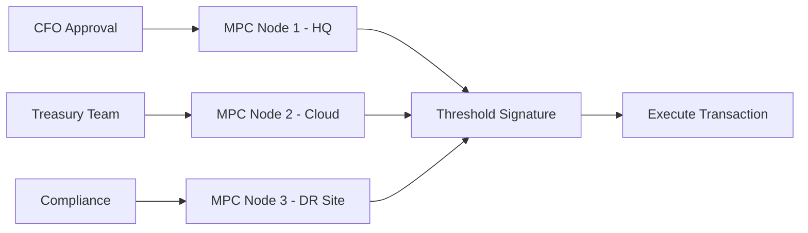
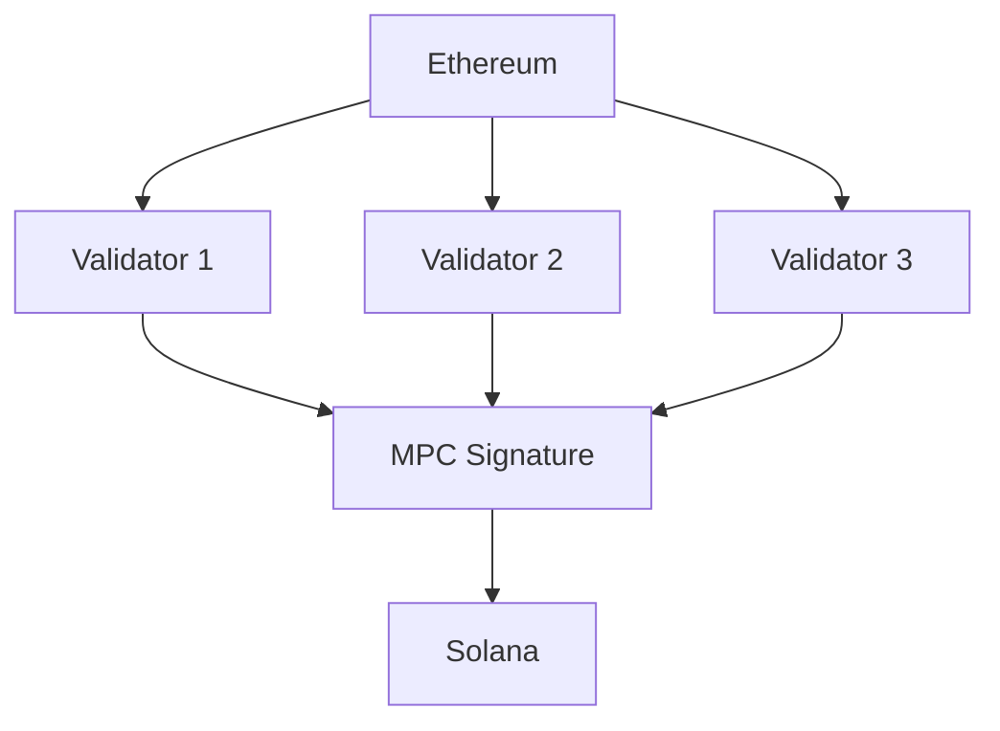

# Use Cases & Integration Patterns

## Enterprise Custody Solutions

### Digital Asset Treasury Management

Large organizations managing substantial crypto holdings use Lux MPC for:

**Challenge**: Secure storage of billions in digital assets while maintaining operational efficiency.

**Solution Architecture**:


**Implementation**:
```go
// Configure 3-of-5 threshold for high-value transactions
config := mpc.Config{
    Threshold: 3,
    Parties:   5,
    Locations: []string{
        "headquarters",
        "aws-us-east",
        "azure-europe",
        "gcp-asia",
        "colocation-dr",
    },
}

// Require additional approval for large transfers
if amount > 10_000_000 {
    requireApprovals := []string{"cfo", "coo", "compliance"}
}
```

**Benefits**:
- No single point of failure
- Geographic distribution
- Regulatory compliance
- Audit trail

### Institutional Trading

**Use Case**: High-frequency trading firms requiring rapid, secure transaction signing.

**Requirements**:
- Sub-second signature generation
- 24/7 availability
- Integration with trading systems

**Architecture**:
```go
// Low-latency configuration
type TradingMPCConfig struct {
    Threshold:        2
    Parties:          3
    MaxLatency:       100 * time.Millisecond
    PreprocessBatch:  1000 // Pre-generate signing materials
    LocationStrategy: "same-datacenter"
}
```

## DeFi Protocols

### Decentralized Exchanges (DEX)

**Challenge**: Secure management of liquidity pool keys without centralized control.

**Implementation**:
```solidity
// Smart contract integration
contract DEXVault {
    address public mpcAddress;

    function executeSwap(
        bytes calldata signature,
        SwapParams calldata params
    ) external {
        // Verify MPC signature
        require(verifyMPCSignature(signature, params));
        // Execute swap
    }
}
```

**MPC Configuration**:
```typescript
// TypeScript client for DEX integration
import { MPCClient } from '@luxfi/mpc-client';

const client = new MPCClient({
    nodes: [
        'wss://node1.dex.example',
        'wss://node2.dex.example',
        'wss://node3.dex.example'
    ],
    threshold: 2
});

// Sign swap transaction
const signature = await client.sign({
    walletId: 'dex-liquidity-pool',
    message: swapData,
    signers: ['node1', 'node2'] // Any 2 of 3
});
```

### Cross-Chain Bridges

**Use Case**: Secure asset transfers between blockchains.

**Architecture**:


**Implementation**:
```go
// Bridge validator node
type BridgeValidator struct {
    mpcNode     *mpc.Node
    ethMonitor  *ethereum.Monitor
    solExecutor *solana.Executor
}

func (b *BridgeValidator) ProcessBridgeRequest(req Request) {
    // Verify on source chain
    if !b.ethMonitor.VerifyDeposit(req) {
        return
    }

    // Sign with MPC
    sig, _ := b.mpcNode.SignTransaction(
        req.DestinationTx,
        mpc.ThresholdSigners(3, 5),
    )

    // Execute on destination
    b.solExecutor.Mint(req.Recipient, req.Amount, sig)
}
```

## Web3 Infrastructure

### Blockchain Validators

**Challenge**: Secure validator key management for Proof-of-Stake networks.

**Solution**:
```yaml
# Validator MPC configuration
validator:
  consensus_key:
    type: mpc
    threshold: 2
    parties: 3
    nodes:
      - id: primary
        location: aws-us-east-1
      - id: secondary
        location: gcp-europe-west1
      - id: backup
        location: azure-japaneast
```

**Benefits**:
- Slash protection through distributed keys
- High availability
- Automated key rotation

### Oracle Networks

**Use Case**: Decentralized oracles requiring consensus on data feeds.

```javascript
// Oracle node implementation
class MPCOracle {
    async submitPriceFeed(price) {
        // Each oracle node signs with its MPC share
        const signature = await this.mpcClient.sign({
            walletId: 'oracle-key',
            message: {
                price: price,
                timestamp: Date.now(),
                source: this.dataSource
            }
        });

        // Submit to aggregator
        await this.aggregator.submit(signature);
    }
}
```

## Payment Systems

### Cryptocurrency Payment Processors

**Challenge**: Accept crypto payments while maintaining security.

**Architecture**:
```typescript
// Payment processor integration
class PaymentProcessor {
    private mpc: MPCClient;

    async processPayment(payment: Payment) {
        // Generate unique address for payment
        const address = await this.mpc.deriveAddress(
            payment.id,
            payment.currency
        );

        // Monitor for payment
        await this.monitor.watchAddress(address);

        // Auto-sweep to cold storage
        if (payment.confirmed) {
            await this.mpc.sweepToCold(address);
        }
    }
}
```

### Remittance Services

**Use Case**: International money transfers using stablecoins.

```go
// Remittance service backend
func ProcessRemittance(transfer Transfer) error {
    // Convert fiat to stablecoin
    stablecoin := ConvertToUSDC(transfer.Amount)

    // Sign transfer with MPC
    tx := BuildTransaction(
        transfer.Recipient,
        stablecoin,
    )

    signature, _ := mpcNode.Sign(
        tx.Hash(),
        RequireCompliance(), // Compliance node must participate
    )

    // Execute on blockchain
    return SubmitTransaction(tx, signature)
}
```

## Gaming & NFTs

### GameFi Treasury Management

**Challenge**: Manage in-game economies with millions in value.

```javascript
// Game treasury manager
class GameTreasury {
    constructor(mpcClient) {
        this.mpc = mpcClient;
        this.threshold = 3; // 3-of-5 for treasury ops
    }

    async mintRewards(players, amounts) {
        const batch = players.map((player, i) => ({
            to: player,
            amount: amounts[i],
            token: 'GAME'
        }));

        // Batch sign all rewards
        const signatures = await this.mpc.batchSign(batch);
        return this.distributeRewards(signatures);
    }
}
```

### NFT Marketplaces

**Use Case**: Secure escrow for high-value NFT trades.

```solidity
// NFT Escrow Contract
contract NFTEscrow {
    mapping(uint256 => Trade) public trades;

    function completeTrade(
        uint256 tradeId,
        bytes calldata mpcSignature
    ) external {
        Trade memory trade = trades[tradeId];

        // Verify MPC authorized the trade
        require(
            verifyMPCSignature(
                keccak256(abi.encode(trade)),
                mpcSignature
            )
        );

        // Transfer NFT and payment
        transferNFT(trade.nft, trade.buyer);
        transferPayment(trade.payment, trade.seller);
    }
}
```

## Compliance & Regulatory

### Travel Rule Compliance

**Implementation**:
```go
// FATF Travel Rule implementation
type TravelRuleCompliance struct {
    mpc *mpc.Node
    kyc *KYCProvider
}

func (t *TravelRuleCompliance) TransferWithCompliance(
    transfer Transfer,
) error {
    // Verify KYC
    if !t.kyc.Verify(transfer.Originator, transfer.Beneficiary) {
        return ErrKYCRequired
    }

    // Require compliance officer in signing
    signers := []string{
        "operations",
        "compliance", // Mandatory
        "treasury",
    }

    return t.mpc.SignWithRequired(
        transfer,
        signers,
        []string{"compliance"}, // Must include
    )
}
```

### Regulatory Reporting

```python
# Automated regulatory reporting
class RegulatoryReporter:
    def __init__(self, mpc_client):
        self.mpc = mpc_client

    async def generate_report(self, period):
        # All transactions require MPC signature
        transactions = await self.mpc.get_transactions(period)

        report = {
            'period': period,
            'transactions': transactions,
            'total_volume': sum(tx.amount for tx in transactions),
            'unique_addresses': len(set(tx.address for tx in transactions))
        }

        # Sign report with MPC
        signature = await self.mpc.sign_document(report)
        return self.submit_to_regulator(report, signature)
```

## Advanced Integration Patterns

### Multi-Cloud Deployment

```yaml
# Kubernetes deployment across clouds
apiVersion: apps/v1
kind: StatefulSet
metadata:
  name: mpc-nodes
spec:
  replicas: 5
  template:
    spec:
      affinity:
        podAntiAffinity:
          requiredDuringSchedulingIgnoredDuringExecution:
          - topologyKey: failure-domain.beta.kubernetes.io/zone
      containers:
      - name: mpc-node
        image: luxfi/mpc:latest
        env:
        - name: NODE_ID
          valueFrom:
            fieldRef:
              fieldPath: metadata.name
        - name: CLOUD_KMS
          value: "enabled" # Use cloud HSM
```

### Disaster Recovery

```go
// Automated DR with MPC resharing
func DisasterRecovery(failedNodes []string) error {
    // Identify healthy nodes
    healthyNodes := mpc.GetHealthyNodes()

    if len(healthyNodes) < mpc.Threshold {
        return ErrInsufficientNodes
    }

    // Initiate resharing to exclude failed nodes
    newShares := mpc.Reshare(
        healthyNodes,
        mpc.Threshold,
        len(healthyNodes),
    )

    // Deploy new nodes
    newNodes := DeployBackupNodes(len(failedNodes))

    // Distribute shares to new nodes
    return mpc.DistributeShares(newNodes, newShares)
}
```

### Performance Optimization

```go
// Preprocessing for high-throughput
type HighPerformanceMPC struct {
    preprocessQueue chan PreprocessedTriple
    mpc            *mpc.Node
}

func (h *HighPerformanceMPC) Initialize() {
    // Pre-generate 10,000 signing triples
    go func() {
        for i := 0; i < 10000; i++ {
            triple := h.mpc.GenerateTriple()
            h.preprocessQueue <- triple
        }
    }()
}

func (h *HighPerformanceMPC) FastSign(msg []byte) ([]byte, error) {
    // Use preprocessed triple for instant signing
    triple := <-h.preprocessQueue
    return h.mpc.SignWithTriple(msg, triple)
}
```

## Getting Started

Choose your integration pattern:

1. **API Integration**: REST/WebSocket APIs for existing systems
2. **SDK Integration**: Native libraries for Go, TypeScript, Python
3. **Smart Contract**: On-chain verification of MPC signatures
4. **Hybrid**: Combine multiple patterns for complex use cases

Next steps:
- [API Reference →](/docs/api) for integration details
- [Deployment Guide →](/docs/deployment) for production setup
- [Security Best Practices →](/docs/security#best-practices)